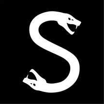

<div align="center">

  

  # SEVERUS CUES
  ### *Strike With Venom Precision*

  [](https://laravel.com)
  [](https://php.net)
  [](https://tailwindcss.com)
  [](https://www.postgresql.org/)
  [](https://www.docker.com/)
  [](https://www.tokopedia.com/severus)
  [](#bilingual-support)

</div>

---

## 🐍 About Severus Cues

**Severus Cues** is a high-performance, dark-themed marketing web application built for premium billiard/pool cues, high-friction chalk, and pro tournament accessories. Designed with a **Venom Snake Green** aesthetic (`#0A0F0D` Obsidian Dark base, `#00E676` Toxic Emerald Green glow), it bridges online product exploration with direct purchasing on the official [Tokopedia Store](https://www.tokopedia.com/severus).

---

## ✨ Key Features

- **🌐 Bilingual i18n Support (EN & ID)**:
  - Instant session locale switcher between English and Indonesian.
  - Full translation coverage across product specifications (tip diameter, joint type, deflection rating, chalk friction), hero copy, and team portal.
- **⚡ Separated Docker Architecture**:
  - **`severus-db`**: PostgreSQL 16 database container (`postgres:16-alpine`).
  - **`severus-backend`**: PHP 8.3-FPM container with PDO, `pdo_pgsql`, `pgsql`, GD, BCMath, and Zip extensions.
  - **`severus-frontend`**: Nginx web server configured for Laravel static caching and routing.
- **🎮 Gaming PC Resource Management**:
  - **`severus-on.bat`**: One-click startup for dev mode (`http://localhost:8000`). Runs database migrations and seeders automatically.
  - **`severus-off.bat`**: One-click shutdown (`docker compose down`) releasing 100% of RAM and CPU for gaming.
- **🚀 Dual Application Portals**:
  1. **Customer Landing Portal (`/`)**: Fixed glassmorphism top navbar, hero banner, interactive cue & chalk catalog with category filters, technical spec modals, and direct Tokopedia checkout links (`https://www.tokopedia.com/severus`).
  2. **Inside Team Admin Portal (`/admin`)**: Product management (add/edit/delete, image uploader, pricing, cue attributes), Tokopedia live price monitor, and banner copy editor.
- **🛒 Tokopedia Integration & Price Sync Engine**:
  - Direct buy links for all products pointing to the official store: `https://www.tokopedia.com/severus`.
  - Built-in sync command (`php artisan severus:sync-tokopedia`) that crawls prices from Tokopedia, logs audit trails, and updates product catalog records.

---

## 🛠️ Technology Stack

| Layer | Technology |
| :--- | :--- |
| **Framework** | Laravel 11 / 13 Ready (PHP 8.3) |
| **Database** | PostgreSQL 16 (`postgres:16-alpine`) |
| **Styling** | Vanilla CSS + Tailwind CSS (Venom Green Palette) |
| **Interactivity** | Alpine.js |
| **Server** | Nginx Alpine |
| **Containers** | Docker & Docker Compose |
| **Typography** | Google Fonts (*Outfit* & *Inter*) |

---

## 🚀 Quick Start Guide

### Prerequisites
- [Docker Desktop](https://www.docker.com/products/docker-desktop/) (No host PHP or MySQL installation required).

### Turn ON Development Environment
Double click or run from project root:
```cmd
severus-on.bat
```
- **Public Customer App**: `http://localhost:8000`
- **Inside Team Admin Portal**: `http://localhost:8000/admin`
  - **Default Credentials**: `admin@severus.com` / `severus123`

### Turn OFF Development Environment (Gaming Mode)
Double click or run from project root:
```cmd
severus-off.bat
```
*This gracefully stops all containers and cleans up memory/CPU so your PC is 100% free for gaming.*

---

## ⚙️ Maintenance & Manual Commands

- **Run Tokopedia Price Sync**:
  ```bash
  docker compose exec backend php artisan severus:sync-tokopedia
  ```
- **Reseed Database Catalog**:
  ```bash
  docker compose exec backend php artisan db:seed --force
  ```
- **View Container Logs**:
  ```bash
  docker compose logs -f
  ```

---

## 🛡️ Security Architecture & Audit

The application underwent a comprehensive security audit across all public and administrative pages. Detailed findings, mitigation models, and testing results are documented in [**`SECURITY_AUDIT.md`**](file:///d:/PROJECT/Severus/Severus/SECURITY_AUDIT.md).

- **HTTP Security Headers**: Enforced natively on all responses via `SecurityHeaders` middleware (`X-Frame-Options: SAMEORIGIN`, `X-Content-Type-Options: nosniff`, `Referrer-Policy: strict-origin-when-cross-origin`, `X-XSS-Protection: 1; mode=block`).
- **Brute-Force Rate Limiting**: `/admin/login` protected with `throttle:6,1` (maximum 6 attempts per minute).
- **Injection Defense**: 100% parameter-bound queries via Eloquent ORM.
- **Output Encoding**: Universal Blade escaping (`{{ ... }}`) across all views with zero unescaped interpolations.
- **CSRF Defense**: `@csrf` token validation on all state-modifying POST/PUT/DELETE forms.

---

## 📦 Project Structure

```
Severus/
├── app/
│   ├── Console/Commands/SyncTokopediaCommand.php
│   ├── Http/Controllers/
│   │   ├── Admin/ (Dashboard, Product & Content Controllers)
│   │   ├── LandingController.php
│   │   ├── ProductController.php
│   │   └── LanguageController.php
│   ├── Http/Middleware/
│   │   ├── SecurityHeaders.php (X-Frame-Options, nosniff, Referrer-Policy)
│   │   └── SetLocale.php (EN / ID bilingual session binder)
│   ├── Models/ (User, Category, Product, SiteContent, TokopediaSyncLog)
│   └── Services/TokopediaSyncService.php
├── docker/
│   ├── Dockerfile
│   └── nginx.conf
├── lang/
│   ├── en/app.php
│   └── id/app.php
├── public/images/logo.png
├── resources/
│   ├── css/app.css (Venom Snake / Reaper Grim styling)
│   └── views/ (Landing, Show, Admin portal views)
├── DESIGN_CONCEPTS.md (Named overlays & component design catalog)
├── SECURITY_AUDIT.md (Comprehensive page-by-page security audit report)
├── PROJECT_BRAIN.md (Authoritative architecture brain)
├── docker-compose.yml
├── severus-on.bat
└── severus-off.bat
```

---

## 📄 License & Repository

Developed for **Severus Cues**. Repository hosted at [https://github.com/nyanky0/Severus.git](https://github.com/nyanky0/Severus.git).
